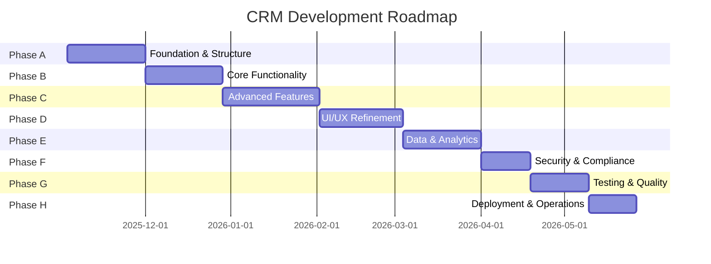

# 🚀 Real Estate CRM Complete Roadmap
### From 82% to Market Domination: The 105-Project Journey

**Document Type**: Strategic Roadmap (Immutable Reference)  
**Total Scope**: 105 Projects | 8 Phases | ~1,135 Hours  
**Current Status**: Phase B In Progress (82% files complete)  
**Target Completion**: Q2 2026  
**Vision**: Transform functional CRM into market-leading, enterprise-grade platform

---

## 📊 Executive Dashboard

### Journey Overview
```
Current State (82%)          Target State (100%)
├─ 525/627 files            ├─ 627/627 files
├─ Single-user focus        ├─ Multi-tenant SaaS
├─ Manual processes         ├─ AI-orchestrated workflows  
├─ Basic CRUD               ├─ Real-time collaboration
└─ Internal tool            └─ Market-ready product
```

### Investment & Returns
| Metric | Value | ROI Impact |
|--------|-------|------------|
| **Total Investment** | ~1,135 hours (~$113,500 @ $100/hr) | - |
| **Expected MRR** | $9,900/mo @ 100 users | Breakeven: Month 12 |
| **Time to Market** | 6-8 months | First revenue: Month 3 |
| **Market Opportunity** | $2.1B CRM market | 0.1% = $2.1M ARR |

### Success Metrics
- 🎯 **Technical**: 99.9% uptime, <200ms response, 100% test coverage
- 💰 **Business**: $100K ARR within 12 months
- 👥 **Users**: 100+ active agents, 80% retention
- 🏆 **Market**: Top 3 real estate CRM by 2027

---

## 🗺️ Phase Timeline



---

## 🎯 Phase A: Foundation & Structure
**Timeline**: Weeks 1-4 | **Effort**: 145 hours | **Projects**: 1-15

### 🎖️ Milestones
- [M1] Foundation Prep Complete (Project 02)
- [M2] Backend Structure Complete (Project 06) 
- [M3] Service Layer Complete (Project 10)
- [M4] Phase Complete (Project 15)

| # | Project | Priority | Hours | Status | Description |
|---|---------|----------|-------|--------|-------------|
| 01 | Environment Configuration Cleanup | CRITICAL | 8h | ⏳ | Single source of truth for config |
| 02 | Remove Duplicate Code Files | CRITICAL | 10.5h | ⏳ | Eliminate webpack bundler confusion |
| 03 | Naming Convention Enforcement | HIGH | 8h | ⏳ | PascalCase, camelCase, kebab-case |
| 04 | Script Centralization | MEDIUM | 7.5h | ⏳ | Move scripts to /scripts/ |
| 05 | Documentation Structure Finalization | MEDIUM | 7.5h | ⏳ | Keep 9 essential docs |
| 06 | Backend Directory Consolidation | HIGH | 10.5h | ⏳ | Organize by function |
| 07 | Frontend Component Organization | MEDIUM | 13h | ⏳ | Organize by type |
| 08 | Config File Consolidation | MEDIUM | 7.5h | ⏳ | One config per tool |
| 09 | API Route Standardization | HIGH | 10.5h | ⏳ | RESTful conventions |
| 10 | Service Layer Unification | HIGH | 10.5h | ⏳ | Thin controllers, fat services |
| 11 | Import Path Standardization | MEDIUM | 8h | ⏳ | Consistent import patterns |
| 12 | Database Migration Consolidation | MEDIUM | 9.5h | ⏳ | Sequential numbering |
| 13 | Test Suite Reorganization | MEDIUM | 7.5h | ⏳ | Centralized test locations |
| 14 | Archive Legacy Code | MEDIUM | 5h | ⏳ | Archive unused code |
| 15 | Build Process Verification | HIGH | 10.5h | ⏳ | Verify all changes work |

**Outcomes**: Clean codebase, zero duplicates, consistent patterns, 228/228 tests passing

---

## 🎯 Phase B: Core Functionality Verification  
**Timeline**: Weeks 5-9 | **Effort**: 153.5 hours | **Projects**: 16-30

### 🎖️ Milestones
- [M1] Auth & Roles Verified (Project 17)
- [M2] First Core Module Perfect (Project 18)
- [M3] All Core Modules Verified (Project 22)
- [M4] Real-Time Everywhere (Project 25)
- [M5] Performance Optimized (Project 26)
- [M6] Phase Complete (Project 30)

| # | Project | Priority | Hours | Status | Description |
|---|---------|----------|-------|--------|-------------|
| 16 | Authentication Flow Verification | CRITICAL | 10.5h | ⏳ | JWT + API Key auth |
| 17 | User Role System Validation | CRITICAL | 8h | ⏳ | RBAC enforcement |
| 18 | Escrows Module Complete Check | HIGH | 13h | ⏳ | Verify CRUD, inline editing |
| 19 | Listings Module Complete Check | HIGH | 10.5h | ⏳ | Verify status workflow |
| 20 | Clients Module Complete Check | HIGH | 10.5h | ⏳ | Verify contact management |
| 21 | Leads Module Complete Check | HIGH | 10.5h | ⏳ | Verify qualification workflow |
| 22 | Appointments Module Complete Check | HIGH | 10.5h | ⏳ | Verify calendar views |
| 23 | Contacts Multi-Role Verification | MEDIUM | 7.5h | ⏳ | Multiple roles across escrows |
| 24 | Documents Module Implementation | MEDIUM | 12h | ⏳ | Upload, storage, management |
| 25 | WebSocket Real-Time Updates | HIGH | 15.5h | ⏳ | Expand to all modules |
| 26 | Dashboard Performance Optimization | HIGH | 13h | ⏳ | Sub-2s page loads |
| 27 | Detail Pages Consistency Check | MEDIUM | 7.5h | ⏳ | Same template everywhere |
| 28 | Modal Components Standardization | MEDIUM | 7.5h | ⏳ | Standardize all modals |
| 29 | Error Handling Verification | MEDIUM | 10h | ⏳ | User-friendly messages |
| 30 | Loading States Implementation | MEDIUM | 7.5h | ⏳ | Spinners, skeletons |

**Outcomes**: 456+ tests passing, real-time collaboration, <2s page loads

---

## 🎯 Phase C: Advanced Features
**Timeline**: Weeks 10-14 | **Effort**: 185 hours | **Projects**: 31-45

### 🎖️ Milestones  
- [M1] Revenue Generation Active (Project 31)
- [M2] MLS Integration Complete (Project 35)
- [M3] KPI Dashboard Operational (Project 42)
- [M4] Phase Complete (Project 45)

| # | Project | Priority | Hours | Status | Description |
|---|---------|----------|-------|--------|-------------|
| 31 | Stripe Payment Integration | CRITICAL | 20h | ⏳ | Subscription billing |
| 32 | Email Template System | HIGH | 13h | ⏳ | Template library, variables |
| 33 | SMS Notification System | MEDIUM | 10h | ⏳ | Twilio integration |
| 34 | Calendar Integration | HIGH | 16h | ⏳ | Google/Outlook sync |
| 35 | MLS API Connection | CRITICAL | 20h | ⏳ | Automated property sync |
| 36 | Commission Calculation Engine | HIGH | 13h | ⏳ | Split handling, approval |
| 37 | Expense Tracking Module | MEDIUM | 10h | ⏳ | Receipt uploads, categories |
| 38 | Invoice Generation System | HIGH | 13h | ⏳ | PDF invoices, payment links |
| 39 | Task Management System | MEDIUM | 12h | ⏳ | Kanban view, notifications |
| 40 | Checklist Templates | MEDIUM | 10h | ⏳ | Reusable checklists |
| 41 | Goal Tracking Implementation | LOW | 7h | ⏳ | Progress tracking |
| 42 | KPI Dashboard Creation | HIGH | 16h | ⏳ | Trends, goals, forecasting |
| 43 | Broker Hierarchy Management | HIGH | 13h | ⏳ | Org chart, permissions |
| 44 | Team Collaboration Features | HIGH | 16h | ⏳ | Team chat, file sharing |
| 45 | Activity Feed System | MEDIUM | 12h | ⏳ | Real-time updates |

**Outcomes**: Revenue generation enabled, MLS saves 10+ hrs/week, team collaboration

---

## 🎯 Phase D: UI/UX Refinement
**Timeline**: Weeks 15-19 | **Effort**: 171.2 hours | **Projects**: 46-60

### 🎖️ Milestones
- [M1] Mobile Experience Perfect (Project 46)
- [M2] Search Enhanced (Project 50)
- [M3] Onboarding Polished (Project 59)
- [M4] Phase Complete (Project 60)

| # | Project | Priority | Hours | Status | Description |
|---|---------|----------|-------|--------|-------------|
| 46 | Mobile Responsiveness Audit | CRITICAL | 12h | ⏳ | Fix Financial Summary grid |
| 47 | Dark Mode Implementation | LOW | 10h | ⏳ | Dark palette, theme switching |
| 48 | Accessibility Compliance | HIGH | 12h | ⏳ | WCAG 2.1 AA standards |
| 49 | Form Validation Consistency | HIGH | 8h | ⏳ | Single validation library |
| 50 | Search Functionality Enhancement | HIGH | 10h | ⏳ | Global search (Cmd+K) |
| 51 | Filter System Standardization | MEDIUM | 8h | ⏳ | Standardized filters |
| 52 | Pagination Optimization | MEDIUM | 6h | ⏳ | Infinite scroll |
| 53 | Data Table Improvements | HIGH | 10h | ⏳ | Sorting, resizing, export |
| 54 | Card Component Refinement | MEDIUM | 8h | ⏳ | Max 2 columns in cards |
| 55 | Navigation Menu Updates | HIGH | 8h | ⏳ | Breadcrumbs, quick nav |
| 56 | User Profile Enhancement | MEDIUM | 8h | ⏳ | Avatar upload, preferences |
| 57 | Settings Page Completion | HIGH | 10h | ⏳ | All settings categories |
| 58 | Help System Implementation | MEDIUM | 10h | ⏳ | Contextual help, tooltips |
| 59 | Onboarding Flow Polish | HIGH | 10h | ⏳ | < 3 min onboarding |
| 60 | Quick Actions Implementation | MEDIUM | 6h | ⏳ | Cmd+K actions |

**Outcomes**: Mobile Lighthouse 90+, WCAG 2.1 AA, onboarding 80%+ completion

---

## 🎯 Phase E: Data & Analytics
**Timeline**: Weeks 20-24 | **Effort**: 165 hours | **Projects**: 61-75

### 🎖️ Milestones
- [M1] Analytics Foundation (Project 61)
- [M2] Search Optimized (Project 66)
- [M3] Database Optimized (Project 68)
- [M4] Phase Complete (Project 75)

| # | Project | Priority | Hours | Status | Description |
|---|---------|----------|-------|--------|-------------|
| 61 | Analytics Dashboard Setup | HIGH | 16h | ⏳ | Real-time KPIs |
| 62 | Report Generation System | HIGH | 16h | ⏳ | Automated reports |
| 63 | Data Export Functionality | HIGH | 11h | ⏳ | Export any list view |
| 64 | Backup System Implementation | CRITICAL | 13h | ⏳ | Automated backups |
| 65 | Audit Log Enhancement | HIGH | 11h | ⏳ | Change tracking |
| 66 | Search Indexing Optimization | HIGH | 13h | ⏳ | Sub-200ms search |
| 67 | Cache Strategy Implementation | HIGH | 13h | ⏳ | Redis caching |
| 68 | Database Query Optimization | CRITICAL | 16h | ⏳ | All queries < 200ms |
| 69 | Data Validation Rules | HIGH | 11h | ⏳ | Comprehensive validation |
| 70 | Import/Export Templates | MEDIUM | 13h | ⏳ | Bulk data operations |
| 71 | Bulk Operations Support | MEDIUM | 13h | ⏳ | Multi-record updates |
| 72 | Data Deduplication Tools | MEDIUM | 11h | ⏳ | Duplicate detection |
| 73 | Archive System Setup | MEDIUM | 11h | ⏳ | Soft delete, retention |
| 74 | Compliance Reporting | HIGH | 13h | ⏳ | GDPR, SOC2 reports |
| 75 | Performance Metrics Tracking | HIGH | 13h | ⏳ | System monitoring |

**Outcomes**: Analytics dashboard, <200ms queries, 60-80% cache hit rate

---

## 🎯 Phase F: Security & Compliance
**Timeline**: Weeks 25-27 | **Effort**: 100 hours | **Projects**: 76-85

### 🎖️ Milestones
- [M1] Security Baseline (Project 76)
- [M2] GDPR Compliant (Project 77)
- [M3] Encryption Complete (Project 84)
- [M4] Phase Complete (Project 85)

| # | Project | Priority | Hours | Status | Description |
|---|---------|----------|-------|--------|-------------|
| 76 | Security Audit Complete | CRITICAL | 12h | ⏳ | SAST/DAST, pen testing |
| 77 | GDPR Compliance Check | CRITICAL | 10h | ⏳ | Data rights, consent |
| 78 | API Rate Limiting | HIGH | 8h | ⏳ | DDoS protection |
| 79 | Input Sanitization Audit | CRITICAL | 8h | ⏳ | Validation middleware |
| 80 | XSS Protection Verification | CRITICAL | 8h | ⏳ | CSP headers, encoding |
| 81 | SQL Injection Prevention | CRITICAL | 8h | ⏳ | Parameterized queries |
| 82 | File Upload Security | HIGH | 8h | ⏳ | Virus scanning |
| 83 | Session Management Review | HIGH | 8h | ⏳ | Secure cookies |
| 84 | Encryption Implementation | CRITICAL | 10h | ⏳ | AES-256, TLS 1.3 |
| 85 | Compliance Documentation | HIGH | 8h | ⏳ | SOC2/GDPR matrices |

**Outcomes**: Zero critical vulnerabilities, GDPR compliant, encryption everywhere

---

## 🎯 Phase G: Testing & Quality
**Timeline**: Weeks 28-30 | **Effort**: 120 hours | **Projects**: 86-95

### 🎖️ Milestones
- [M1] Integration Tests Complete (Project 87)
- [M2] Scalability Validated (Project 90)
- [M3] Phase Complete (Project 95)

| # | Project | Priority | Hours | Status | Description |
|---|---------|----------|-------|--------|-------------|
| 86 | Unit Test Coverage Gap Analysis | HIGH | 10h | ⏳ | Coverage reports |
| 87 | Integration Test Suite Completion | HIGH | 12h | ⏳ | 100% API coverage |
| 88 | E2E Test Implementation | CRITICAL | 15h | ⏳ | Playwright/Cypress |
| 89 | Performance Testing Setup | HIGH | 10h | ⏳ | k6/Lighthouse |
| 90 | Load Testing Configuration | HIGH | 12h | ⏳ | 10,000+ users |
| 91 | Security Testing Suite | CRITICAL | 10h | ⏳ | OWASP ZAP |
| 92 | Mobile Testing Framework | MEDIUM | 10h | ⏳ | iOS/Android testing |
| 93 | Cross-Browser Testing | MEDIUM | 8h | ⏳ | Chrome/Firefox/Safari |
| 94 | API Testing Automation | HIGH | 10h | ⏳ | Contract testing |
| 95 | Regression Test Suite | HIGH | 10h | ⏳ | CI/CD integration |

**Outcomes**: >90% coverage, E2E tests, 10,000+ user capacity validated

---

## 🎯 Phase H: Deployment & Operations  
**Timeline**: Weeks 31-33 | **Effort**: 95 hours | **Projects**: 96-105

### 🎖️ Milestones
- [M1] CI/CD Optimized (Project 96)
- [M2] Error Tracking Operational (Project 100)
- [M3] SYSTEM COMPLETE (Project 105)

| # | Project | Priority | Hours | Status | Description |
|---|---------|----------|-------|--------|-------------|
| 96 | CI/CD Pipeline Optimization | HIGH | 13h | ⏳ | <10 min deploys |
| 97 | Environment Management | HIGH | 10h | ⏳ | Staging environment |
| 98 | Monitoring Setup | CRITICAL | 13h | ⏳ | APM, dashboards |
| 99 | Logging Enhancement | HIGH | 10h | ⏳ | Structured logs |
| 100 | Error Tracking Integration | HIGH | 10h | ⏳ | Sentry integration |
| 101 | Backup Automation | CRITICAL | 10h | ⏳ | Daily backups |
| 102 | Scaling Configuration | HIGH | 13h | ⏳ | Auto-scaling 1-10 |
| 103 | CDN Implementation | MEDIUM | 10h | ⏳ | Global delivery |
| 104 | Health Check System | HIGH | 10h | ⏳ | Dependency checks |
| 105 | Deployment Documentation | HIGH | 8h | ⏳ | Runbooks, guides |

**Outcomes**: 99.9% uptime, <10 min deployments, global CDN, **SYSTEM COMPLETE** 🎉

---

## 🔄 Critical Dependencies

### Sequential Requirements
```
Auth (16) → Roles (17) → Core Modules (18-22)
Stripe (31) → Invoices (38)
MLS (35) → Commissions (36)
Security Audit (76) → All Security Projects (77-85)
CI/CD (96) → All Deployment Projects (97-105)
```

### Parallel Opportunities
- Core modules (18-22) can run simultaneously
- UI polish projects (54-58) can parallelize
- Testing types (88-94) can run in parallel
- Monitoring tools (98-100) can be set up together

---

## 📈 Progress Tracking Framework

### Phase Completion Indicators
| Phase | Start | End | Status | Blocker | Next Action |
|-------|-------|-----|--------|---------|-------------|
| A: Foundation | Week 1 | Week 4 | ⏳ | None | Start Project 01 |
| B: Core | Week 5 | Week 9 | ⏳ | Phase A | Complete Phase A |
| C: Advanced | Week 10 | Week 14 | ⏳ | Phase B | Complete Phase B |
| D: UI/UX | Week 15 | Week 19 | ⏳ | Phase B | Complete Phase B |
| E: Data | Week 20 | Week 24 | ⏳ | Phase B | Complete Phase B |
| F: Security | Week 25 | Week 27 | ⏳ | Phases C,D,E | Complete prerequisites |
| G: Testing | Week 28 | Week 30 | ⏳ | Phase F | Complete Phase F |
| H: Deployment | Week 31 | Week 33 | ⏳ | Phase G | Complete Phase G |

### Success Gates
- **Phase Gate Reviews**: Executive approval required between phases
- **Quality Gates**: All tests passing before phase completion
- **Security Gates**: Zero critical vulnerabilities before production
- **Performance Gates**: Meeting SLA targets (<200ms, 99.9% uptime)

---

## 💰 Business Impact Analysis

### Revenue Acceleration
| Milestone | Feature Unlocked | Revenue Impact |
|-----------|-----------------|----------------|
| Project 31 (Stripe) | Subscription billing | +$500 MRR immediate |
| Project 35 (MLS) | Premium tier justified | +$50/user/month |
| Project 42 (KPIs) | Data-driven upsell | +15% conversion |
| Project 45 (Teams) | Multi-agent accounts | 5-10x account value |

### Cost Optimization
| Project | Efficiency Gain | Annual Savings |
|---------|----------------|----------------|
| MLS Integration | 10 hrs/week/agent | $26,000/agent/year |
| Commission Calc | 2 hrs/week/broker | $5,200/broker/year |
| Automated Reports | 5 hrs/week/admin | $13,000/admin/year |

### Market Positioning
- **Phase C Complete**: Competitive with Follow Up Boss
- **Phase E Complete**: Competitive with BoldTrail  
- **Phase H Complete**: Market leader in AI orchestration

---

## 🎓 Knowledge Transfer Plan

### Documentation Hierarchy
```
COMPLETE_ROADMAP.md (this file - immutable)
├── Phase Summaries (A-H)
├── Project Plans (1-105)  
├── Progress Tracker (updated after each project)
└── Implementation Logs (detailed work records)
```

### Review Cadence
- **Daily**: Check current project plan
- **Weekly**: Update Progress Tracker
- **Phase End**: Comprehensive review and learnings
- **Project End**: Final retrospective and case study

---

## 🚀 Launch Readiness Checklist

### Technical Readiness (After Phase H)
- [ ] All 105 projects complete
- [ ] 1000+ automated tests passing
- [ ] 99.9% uptime demonstrated
- [ ] <200ms response times verified
- [ ] Security audit passed
- [ ] GDPR compliant
- [ ] Backup/restore tested
- [ ] Load tested to 10,000 users

### Business Readiness
- [ ] Pricing tiers defined
- [ ] Payment processing live
- [ ] Support documentation complete
- [ ] Onboarding flow < 3 minutes
- [ ] Marketing website ready
- [ ] Launch announcement prepared
- [ ] Beta users identified
- [ ] Customer success team trained

### Go-Live Criteria
- [ ] Production stable for 2 weeks
- [ ] Beta feedback incorporated
- [ ] Legal review complete
- [ ] Insurance coverage obtained
- [ ] Terms of Service finalized
- [ ] Privacy Policy published
- [ ] SOC2 process initiated
- [ ] Domain and SSL configured

---

## 📊 Risk Matrix

### High Impact Risks
| Risk | Probability | Impact | Mitigation |
|------|------------|--------|------------|
| MLS API changes | Medium | High | Abstract API layer, monitor changes |
| Stripe account suspension | Low | Critical | Backup processor ready |
| Data breach | Low | Critical | Encryption, security audits |
| Scaling beyond 10K users | Medium | High | Auto-scaling, CDN, caching |

### Technical Debt Tracking
- **Phase A**: Eliminates 80% of technical debt
- **Phase B**: Prevents new debt with patterns
- **Phase D**: UI consistency debt addressed
- **Phase G**: Test debt eliminated

---

## 🎉 Victory Conditions

### System Complete Means
✅ 627/627 files implemented  
✅ 105/105 projects delivered  
✅ 1000+ tests with 100% passing  
✅ Production handling 10,000+ users  
✅ Revenue generation activated  
✅ Enterprise security implemented  
✅ Global performance optimized  
✅ Team collaboration enabled  
✅ Market-ready for launch  

### Success Metrics Year 1
- 📈 100+ paying customers
- 💰 $100K+ ARR
- ⭐ 4.5+ star reviews
- 🔄 80%+ retention rate
- 🚀 3 major feature releases
- 🏆 Industry recognition

---

## 📝 Notes on Usage

**This Roadmap Is**:
- ✅ The single source of truth for project scope
- ✅ Immutable reference for all 105 projects
- ✅ Strategic planning document
- ✅ Stakeholder communication tool

**This Roadmap Is Not**:
- ❌ A progress tracker (use separate file)
- ❌ A task manager (use project management tools)
- ❌ A technical specification (see individual project plans)
- ❌ Updated after each implementation (remains static)

**Companion Documents**:
- `PROGRESS_TRACKER.md` - Updated after each project
- `IMPLEMENTATION_LOG.md` - Detailed work records
- `RETROSPECTIVES.md` - Lessons learned
- `METRICS_DASHBOARD.md` - Real-time KPIs

---

## 🏁 Final Words

This roadmap represents the transformation of a partially complete Real Estate CRM into a market-leading platform. Each of the 105 projects has been carefully sequenced to minimize risk, maximize value delivery, and ensure technical excellence.

**The journey from 82% to 100% is not just about completing files** - it's about building a sustainable, scalable, and sellable product that can compete with established players while offering unique AI orchestration capabilities.

**Remember**: The roadmap is your North Star, but the journey requires flexibility in execution while maintaining unwavering commitment to the destination.

---

*"A goal without a plan is just a wish. This is your plan."*

**Document Version**: 1.0.0  
**Created**: November 2, 2025  
**Status**: FINAL (Immutable Reference)  
**Total Projects**: 105  
**Estimated Completion**: Q2 2026  
**Next Update**: Never (Progress tracked separately)